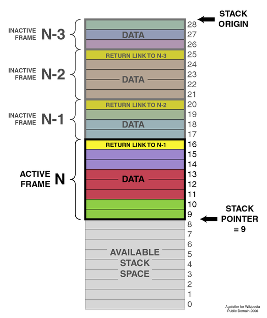

# Ownership and Borrowing

## Memory Management
Memory management is something that's handled differently according to the programming language. For a running program
there are two areas of RAM it can use to store data: the stack and the heap.
### Stack
The stack is used for **static** memory allocation, and it uses a LIFO (last in, first out) data structure. 
Each running thread has its own stack, as well as a register that points to the current top of the stack: the **stack pointer**. 
Accessing and storing data on the stack is very efficient: it's as easy as pushing onto or popping values off the stack.
You can't store everything on the stack though, only data that is of a known and fixed size.
When a program is running, this is what its stack might look like:

Each function gets its own stack frame, which is an area that is populated by the **return address of the calling function**, the
**function arguments** and the **static data and pointers in the function scope**. When a function returns to the return address specified at the bottom of the current stack frame, all the values in the stack frame are popped off. This is done by the OS, and is not something programmers need to think about. As you can see in the image, the stack grows **downwards**. 
A **stack overflow** error happens when the call stack of a program exceeds the maximum size of the stack.

### Heap
The heap is an unstructured blob of data that is used for **dynamic memory allocation**. When you want to create something that has
an unknown size at compile time (a Rust `Vec`, for example), it will be stored on the heap and referenced by a memory address 
(**pointer**). There are a couple big differences with the stack:
* Looking up data on the heap is **slower** than on the stack.
* The heap is **shared** among application threads.
* Managing data on the heap is not done by the OS, and is either the task of the programmer or the programming language.
A lot of bugs originate from mismanaging data on the heap.
* Stores more complex data types (`String`, `Vec`, `HashMap`, `Box`) and global variables.

### Approaches to memory management
We look at the 2 main approaches: manual memory management and garbage collection. If you are interested, these are some of the other
(less common) ones: RAII (Resource Acquisition is Initialization) and ARC (Automatic Reference Counting).
#### Manual memory management
You have to manually allocate and free memory, and make sure you're causing
memory bugs like dangling pointers or use-after-free errors. Languages that fall under this category are C and C++.
The standard library provides you with the `malloc`-type functions to allocate as well as `free` to free memory on the heap.

#### Garbage Collection (GC)
Automatic freeing of unused heap memory. This is part of the runtime of the language and runs at intervals, which can cause
a slight overhead. A lot of modern languages use this approach: JavaScript, C#, Golang, Ruby, Java (and JVM languages).

## MM in Rust: Ownership

## Sources
* [Rust Book on Ownership](https://doc.rust-lang.org/book/ch04-00-understanding-ownership.html)